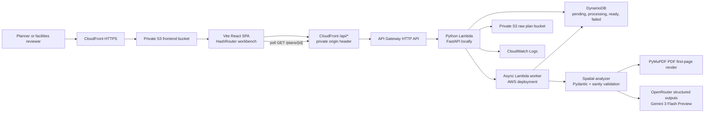

# Architecture

Spatial Stack is a lean serverless prototype: a static spatial-review workbench calls a Python API that owns upload handling, OpenRouter model invocation, dual validation, shared plan status, persistence, raw-plan storage, polling, and origin protection.

Editable Draw.io source: [`docs/aws-architecture.drawio`](aws-architecture.drawio). PNG export: [`docs/aws-architecture.png`](aws-architecture.png).

## Services And Choices

- **Frontend:** Vite, React, TypeScript, Tailwind CSS, `HashRouter`, and local UI primitives. The app builds to static assets, so it can be served from private S3 through CloudFront without a Node server.
- **Viewer:** The core model renderer is an interactive SVG projection, not a WebGL dependency. It supports 3D-style prism view, top view, pan, zoom, rotation, measuring, sun/orientation controls, material previews, furniture toggles, walk-through preview, SVG export, and spatial JSON export.
- **API:** FastAPI runs locally, while the same endpoint logic is exposed through a Lambda-compatible handler in AWS. API Gateway HTTP API sits behind CloudFront `/api/*`.
- **Origin protection:** CloudFront injects a Terraform-generated private header on `/api/*` requests. The Lambda handler rejects direct API Gateway calls when `API_ORIGIN_HEADER_VALUE` is configured.
- **Persistence:** Local development uses in-memory state. In AWS, DynamoDB stores shared plan records, worker status, final analysis contracts, and audit entries with a `pk`/`sk` table design. Private S3 stores uploaded raw floor plans.
- **AI runtime:** OpenRouter Chat Completions is the required model path for floor-plan interpretation. The backend runs Gemini 3 Flash Preview by default with strict JSON Schema structured output, validates the response with Pydantic, makes linked space polygons authoritative for room bounds, and applies sanity checks before returning a result. `OPENROUTER_MODEL` or Terraform's `openrouter_model` can override the default.
- **PDF support:** The backend renders the first page of a PDF to JPEG with PyMuPDF, then sends that image through the same OpenRouter analysis path.
- **Image support:** Floor-plan images are sent to OpenRouter as base64 data URLs behind the backend boundary.
- **Guardrails and cost:** Terraform includes short Lambda log retention, API throttling, Lambda reserved concurrency, raw-plan S3 expiry, optional AWS Budgets, SNS email alerts, and CloudWatch usage or billing alarms.

## Data Flow

1. The browser loads the static React workbench from CloudFront.
2. The Workspace route calls `GET /health` and `GET /sample-files` through the configured API base URL.
3. The user chooses `C1.jpg`, `floorplan.pdf`, or uploads a PNG, JPG, or PDF.
4. The frontend sends the file to `POST /plans/analyze`, or calls `POST /sample-files/{filename}/analyze` for bundled samples.
5. Locally, the backend creates a `plan-*` ID, saves a pending shared record, returns `202`, and runs the worker in a background task.
6. In AWS, the API Lambda stores the raw upload in S3, writes a pending plan record to DynamoDB, invokes itself asynchronously, and returns the plan ID immediately.
7. The async worker marks the record `processing`, reads the upload, renders PDF page 1 to JPEG when needed, and sends the floor-plan image to OpenRouter.
8. OpenRouter is called with `response_format: { type: "json_schema" }`; Gemini 3 Flash Preview returns a structured JSON object describing plan name, building type, floors, total area, spaces, rooms, furniture, geometry primitives, and metrics.
9. Python normalizes the payload, fills safe display defaults, infers room types when needed, uses linked space polygons as the geometry authority for matching room bounds, repairs renderer-hostile fallback geometry, and validates the contract with Pydantic.
10. The analyzer runs sanity checks against both the raw model payload and validated contract: no rooms, missing dimensions, severe room overlap when room rectangles are the only geometry, furniture outside rooms, and low confidence all mark the attempt bad.
11. If the configured model attempt fails validation or sanity checks, the plan is marked `failed`.
12. Status updates such as `statusMessage` and `progressPct`, plus the final validated analysis contract, are saved to the active store. In local development this is memory; in AWS these are DynamoDB records shared by all users of the prototype.
13. The frontend polls `GET /plans/{planId}` during local and deployed analysis, renders the contract as an interactive model when ready, and shows the original plan preview and top-view overlay for source comparison.
14. `GET /plans` feeds the shared Recent Plans list so users can reopen ready plans or wait on pending and processing records instead of re-running slow analysis.
14. The user can export the visual SVG scene or the underlying spatial JSON contract.

## Dual Validation Flow

The OpenRouter response is treated as evidence, not as the final authority. The backend applies OpenRouter's structured-output constraint plus two validation layers before rendering:

| Layer | What It Checks | Failure Behavior |
|---|---|---|
| Strict JSON Schema | OpenRouter must return the required structured object rather than prose or malformed JSON. | The attempt fails before contract parsing. |
| Pydantic contract validation | Required fields, types, aliases, room metrics, furniture shape, and plan metadata. | The attempt fails and the saved plan is marked failed. |
| Sanity checks | Empty room extraction, missing dimensions, severe room overlap when room rectangles are the only geometry, out-of-room furniture, and low confidence. | The attempt fails and the saved plan is marked failed. |

This keeps model behavior predictable: one configured model produces one structured contract, and weak output fails visibly instead of being blended with a second model's interpretation.

## Endpoint Contract

| Endpoint | Purpose |
|---|---|
| `GET /health` | Confirms the backend is reachable and returns service metadata. |
| `GET /sample-files` | Lists bundled demo plans and preview metadata. |
| `GET /sample-files/{filename}` | Serves a bundled sample plan inline for source preview. |
| `GET /sample-files/{filename}/preview` | Serves an image preview, including PDF first-page preview. |
| `POST /sample-files/{filename}/analyze` | Queues the same analysis pipeline on a bundled sample and returns a saved plan record for polling. |
| `POST /plans/analyze` | Accepts multipart uploads locally and Lambda/API Gateway uploads when deployed; returns a pending plan record for polling. |
| `GET /plans` | Lists shared stored plan summaries, including pending, processing, ready, and failed records. |
| `GET /plans/{planId}` | Returns one stored plan record: `pending`, `processing`, `ready`, or `failed`. |
| `POST /reset` | Clears stored plan analyses in the active store. |

The Lambda handler also accepts raw binary bodies with an `x-filename` header, which keeps the deployed route flexible if a client cannot send multipart data.

## Spatial Contract

When analysis is complete, the API returns a `PlanAnalysis` object:

- `id`, `name`, `status`, `sourceFile`, `contentType`, `processingMode`, and optional `modelId`.
- `buildingType`, `floors`, `totalAreaSqm`, and `notes`.
- `rooms`, where each room has `id`, `name`, `type`, `areaSqm`, `widthM`, `depthM`, `xM`, `yM`, `confidence`, and `furniture`.
- `metrics`, including `roomCount`, `circulationAreaSqm`, `estimatedWallLengthM`, `furnitureFitScore`, and `sightlineScore`.

While analysis is still running, the same endpoints return a `PlanRecord` with `status`, `statusMessage`, `progressPct`, `sourceFile`, `contentType`, timestamps, and optional `error`. The frontend treats those fields as the source of truth for the loading overlay and shared Recent Plans queue.

The frontend treats that contract as the system of record. It does not re-run model inference, ask an LLM for display values, or calculate hidden room metadata in the browser.

## Decision Ownership

| Layer | System of record | Output |
|---|---|---|
| Source evidence | Uploaded floor plan and raw-plan S3 object when configured | Original PNG, JPG, or PDF source. |
| Model interpretation | OpenRouter via backend API | Strict JSON Schema room, furniture, dimension, and metric payload. |
| Contract validation | Python analyzer and Pydantic models | Typed spatial contract or explicit failed plan. |
| Sanity validation | Python geometry and confidence checks | Empty, incomplete, overlapping, or low-confidence outputs are rejected. |
| Spatial review | React SVG workbench | Interactive model, measurements, room list, source preview, and exports. |
| Persistence | In-memory store locally or DynamoDB in AWS | Shared plan records, worker status, saved analysis contracts, and audit records. |

OpenRouter interprets the drawing through the configured model, but it is not the authority of record for planning approval. Python constrains the response into a valid contract, and the human reviewer compares that contract with the original plan before relying on it.

## Guardrails

- **No frontend AI credentials:** The browser never receives the OpenRouter API key and never calls OpenRouter directly.
- **No fabricated fallback:** If `OPENROUTER_API_KEY` is missing or the configured model attempt fails, the API returns an explicit error. The demo does not silently show a fake layout.
- **Dual validation before rendering:** Pydantic rejects malformed model output, and sanity checks reject empty, incomplete, severely overlapping, out-of-bounds, or low-confidence spatial results before the contract reaches the UI.
- **Private origins:** The frontend bucket is private behind CloudFront OAC. The raw-plan bucket blocks public access and uses server-side encryption.
- **Origin-bypass check:** Deployed Lambda rejects direct API Gateway requests that do not include the CloudFront private header.
- **Small cost envelope:** On-demand DynamoDB, S3 lifecycle expiry, Lambda concurrency caps, API throttles, and optional budget alarms keep the prototype hackathon-friendly.

## Key Tradeoffs

- **SVG renderer instead of Three.js:** SVG is simpler, deterministic, easy to export, and sufficient for a 10-minute institutional demo. It is not a full physics-based or real-time 3D engine.
- **Model-derived dimensions:** Room dimensions and metrics are estimated from the drawing. They support early review and comparison, not construction-grade measurement.
- **First-page PDF only:** The prototype renders the first page of PDFs. Multi-page drawing packages would need page selection and sheet metadata.
- **No authentication:** The CloudFront private header reduces casual API origin bypass, but it is not user authentication. Production would need identity, roles, and audit workflow.
- **OpenRouter key in Lambda environment:** Terraform writes the demo API key to state and Lambda environment variables. Use a hackathon key with a spending limit.
- **Local memory store:** Local development resets state when the process restarts. AWS uses DynamoDB for persistence.
- **No code-compliance engine:** Furniture fit and sightline continuity are planning aids. They are not accessibility, fire-safety, zoning, or building-code determinations.
